# Handmatige installatie Windows 10

Om een handmatige installatie van een bepaalde Operating Systeem voor te bereiden, heeft men dit allemaal nodig:

-   Een USB-stick (minstens 8 GB, maar 16 GB is meer aanbevolen)
-   Internet

## Stap 1
    Via de website: https://www.microsoft.com/nl-nl/software-download/windows10
    kan men het hulpprogramma downloaden en kiezen of men op de huidige computer een OS wil installeren
    of een ISO bestand; die men kan bewaren op een USB-stick. Dit is ideaal voor ieder computer die nog geen OS heeft.
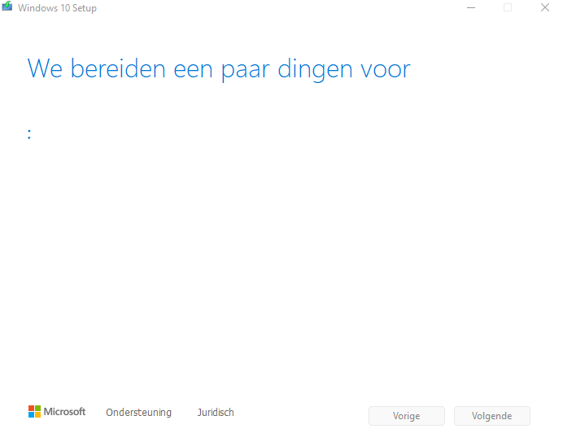
## Stap 2
    Selecteer de installatiemedia (voor een USB-stick)
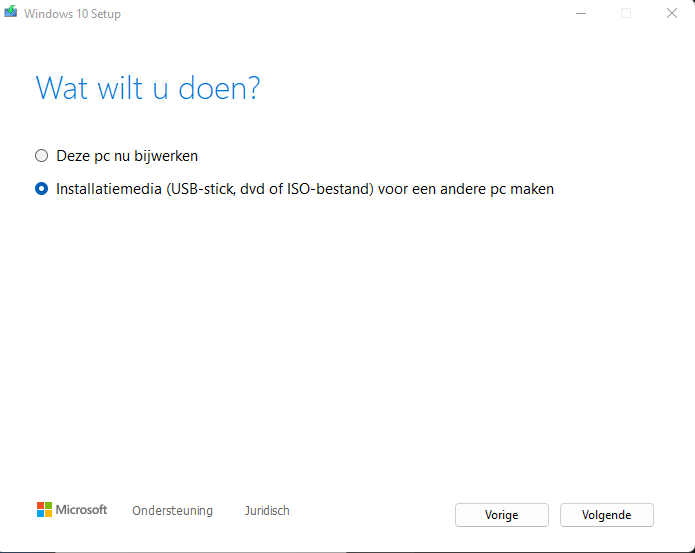
## Stap 3
    Selecteer de taal, architectuur en editie van Windows die men nodig heeft.
    Standaard zijn de aanbevolen opties al geselecteerd.
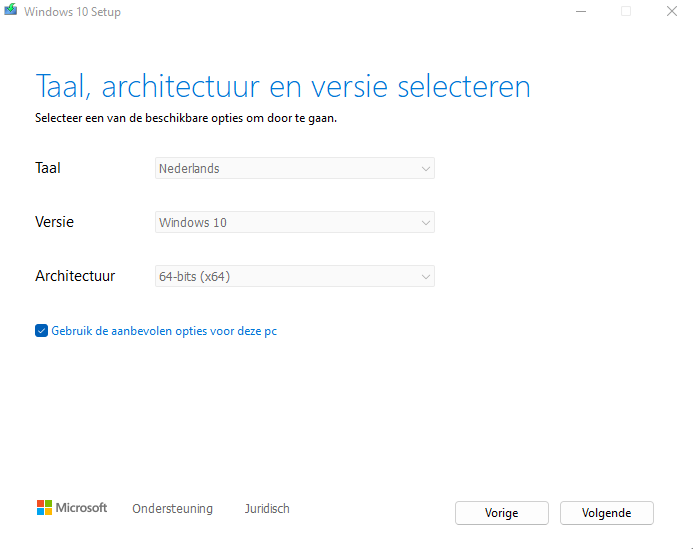
## Stap 4
    Selecteer over welke medium men zal gebruiken. De keuze bestaat uit:
    -   USB-flashstation
    -   ISO-bestand (om later op een dvd te branden)
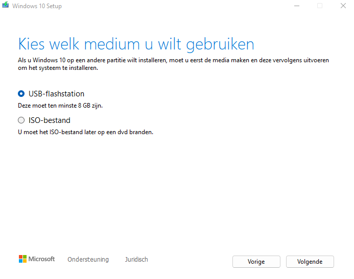
## Stap 5
    Indien er gekozen werd om via een USB-flashstation te installeren, selecteer de USB-stick waar men een OS wilt bewaren.
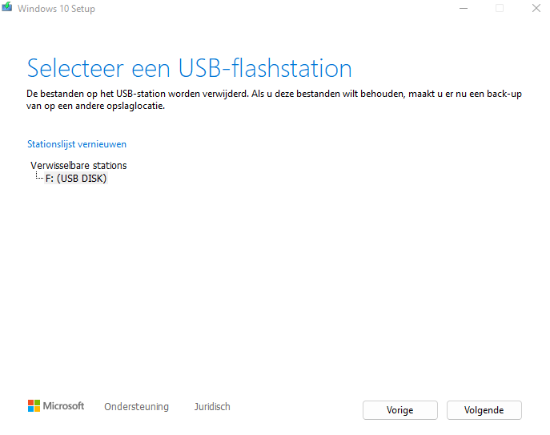
    Eens geselecteerd, zal het even duren totdat de installatie klaar is om een media voor Windows 10 te maken.

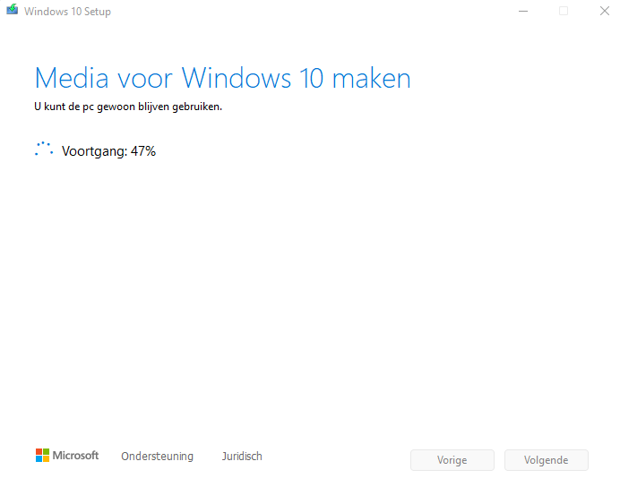
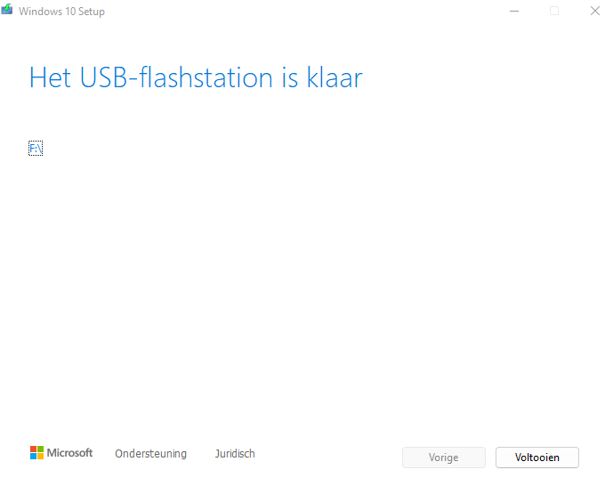

# Installatie uitvoeren

op een computer waar de harde schijf leeg is (zonder OS), Laat men de computer opstarten via USB. Deze regel moet aangepast worden in de BIOS.
Ga naar de volgorde van de boot order of boot sequence zodat het eerst via de USB-flashstation opstart.

Zodra de installatie gestart wordt, zal men de standaard configuraties maken zoals taal, tijd en toetsenbordindeling.
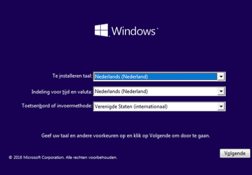

Klik dan op volgende om door te gaan.

## Nu installeren
Klik dan vervolgens op "Nu installeren"

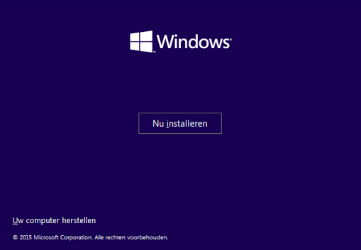
## Productcode
Men kan al het productcode van Windows invoeren. Indien het nog niet van toepassing is, mag men klikken op "Ik heb geen productcode"
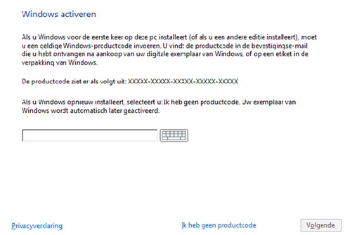
## Windows versie
Er zijn heel wat versies die men kan kiezen, maar hiervoor kiest men de juiste versie. Bijvoorbeeld als menn windows 10 pro gekocht heeft, kiest men
Windows 10 pro en geen Windows 10 home. Kies geen Windows 10 N.
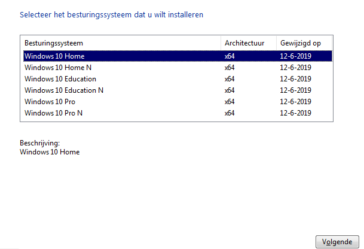
## Type installatie
Kies vervolgens voor "Aangespast: alleen windows installeren (geavanceerd).
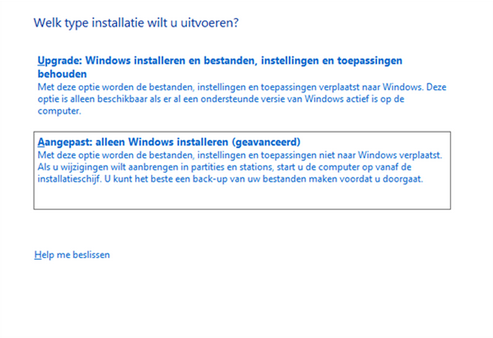
## Harde schijf selecteren
Selecteer op welke harde schijf en/of partie Windows geïnstalleerd moet worden.
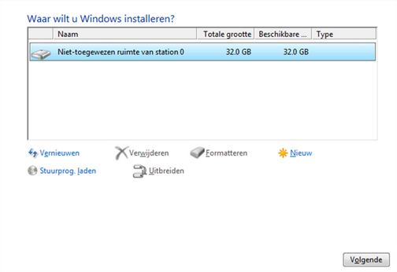
## Installatie uitvoeren
De installatie wordt uitgevoerd en zal de computer opnieuw opgestart worden. Zorg dat de USB-stick verwijderd wordt nadat de installatie voltooid is.
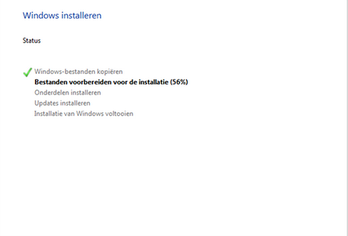

De computer zal een aantal keer herstarten. Vervolgens maakt men de gewenste keuzes in de configuratie van Windows 10. Zodra het voltooid is,
wordt men verwezen naar het bureaublad.